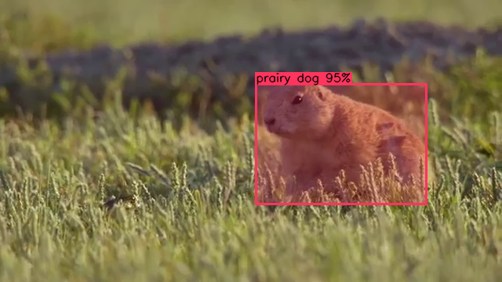
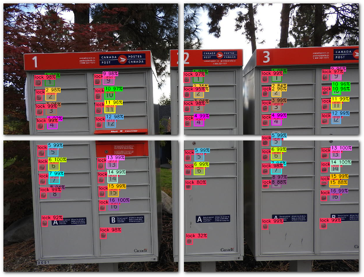

# What is the DarkHelp C++ API?

The DarkHelp C++ API is a wrapper to make it easier to use the Darknet neural network framework within a C++ application.  DarkHelp performs the following:

- load a [Darknet](https://github.com/hank-ai/darknet)-style neural network (.cfg, .names, .weights)
- run inference on images -- either filenames or OpenCV `cv::Mat` images and video frames -- and return [a vector of results](https://www.ccoderun.ca/DarkHelp/api/structDarkHelp_1_1PredictionResult.html#details)
- optionally annotate images/frames with the inference results

Example annotated image after calling [`DarkHelp::NN::predict()`](https://www.ccoderun.ca/DarkHelp/api/classDarkHelp_1_1NN.html#a827eaa61af42451f0796a4f0adb43013)
and [`DarkHelp::NN::annotate()`](https://www.ccoderun.ca/DarkHelp/api/classDarkHelp_1_1NN.html#a718c604a24ffb20efca54bbd73d79de5):



# What is the DarkHelp CLI?

DarkHelp also has [a very simple command-line tool](https://www.ccoderun.ca/darkhelp/api/Tool.html) that uses the DarkHelp C++ API so some of the functionality can be accessed directly from the command-line.  This can be useful to run tests or for shell scripting.

# What is the DarkHelp Server?

DarkHelp Server is a command-line tool that loads a neural network once, and then keeps running in the background.  It repeatedly applies the network to images or video frames and saves the results.

Unlike Darknet and the DarkHelp CLI which have to re-load the neural network every time they're called, DarkHelp Server only does this once.  DarkHelp Server [can be configured](https://www.ccoderun.ca/darkhelp/api/Server.html) to save the results in `.txt` format, `.json` format, annotate images, and can also crop the objects and create individual image files from each of the objects detected by the neural network.

# License

DarkHelp is open source and published using the MIT license.  Meaning you can use it in your commercial application.  See license.txt for details.

# How to Build DarkHelp (Linux)

Extremely simple easy-to-follow tutorial on how to build [Darknet](https://github.com/hank-ai/darknet#table-of-contents), DarkHelp, and [DarkMark](https://github.com/stephanecharette/DarkMark).

[](https://www.youtube.com/watch?v=WTT1s8JjLFk)

DarkHelp requires that [Darknet](https://github.com/hank-ai/darknet) has already been built and installed, since DarkHelp is a *wrapper* for the C functionality available in `libdarknet.so`.

## Building Darknet (Linux)

You must build and install Darknet first.  See the [Darknet repo](https://github.com/hank-ai/darknet#linux-cmake-method) for details.

## Building DarkHelp (Linux)

Now that Darknet is built and installed, you can go ahead and build DarkHelp.  On Ubuntu:

```sh
sudo apt-get install build-essential libtclap-dev libmagic-dev libopencv-dev
cd ~/src
git clone https://github.com/stephanecharette/DarkHelp.git
cd DarkHelp
mkdir build
cd build
cmake -DCMAKE_BUILD_TYPE=Release ..
make
make package
sudo dpkg -i darkhelp*.deb
```

## Building Darknet (Windows)

You must build and install Darknet first.  See the [Darknet repo](https://github.com/hank-ai/darknet#windows-cmake-method) for details.

## Building DarkHelp (Windows)

Once you finish building and installing Darknet, run the following commands in the "Developer Command Prompt for VS" to build DarkHelp:

```bat
cd c:\src\vcpkg
vcpkg.exe install tclap:x64-windows
cd c:\src
git clone https://github.com/stephanecharette/DarkHelp.git
cd darkhelp
mkdir build
cd build
cmake -DCMAKE_BUILD_TYPE=Release -DCMAKE_TOOLCHAIN_FILE=C:/src/vcpkg/scripts/buildsystems/vcpkg.cmake ..
msbuild.exe /property:Platform=x64;Configuration=Release /target:Build -maxCpuCount -verbosity:normal -detailedSummary DarkHelp.sln
msbuild.exe /property:Platform=x64;Configuration=Release PACKAGE.vcxproj
```

Make sure you update the path to the toolchain file if you used a different directory.  Once that last command finishes, you should have a .exe file you can run to install DarkHelp on your system.

> If the CMake command several lines above gives an error about not finding `Darknet`, and you're certain it is installed correctly, then you can specify the path where CMake can find it.  Try this:

```bat
cmake -DCMAKE_BUILD_TYPE=Release -DCMAKE_TOOLCHAIN_FILE=C:/src/vcpkg/scripts/buildsystems/vcpkg.cmake -DDarknet="C:/Program Files/Darknet/lib/darknet.lib" ..
```

> If you get an error about `Could not resolve runtime dependencies: darknet.dll`, then copy that DLL into the `src-tool` directory:

```bat
copy "C:\Program Files\Darknet\bin\darknet.dll" c:\src\DarkHelp\build\src-tool\Release\
```

> ...and re-run the command that failed:

```bat
msbuild.exe /property:Platform=x64;Configuration=Release PACKAGE.vcxproj
```

> Similarly, if you get an error about missing either the CUDA or cuDNN DLLs, then you must copy them like what was done when building Darknet.  For example:

```bat
copy "C:\Program Files\NVIDIA GPU Computing Toolkit\CUDA\v12.2\bin\*.dll" c:\src\DarkHelp\build\src-tool\Release\
copy "C:\Program Files\NVIDIA\CUDNN\v8.x\bin\cudnn64_8.dll" c:\src\DarkHelp\build\src-tool\Release\
```

> Once the files have been copied, re-run the last `msbuild.exe` command to generate the NSIS installation package:

```bat
msbuild.exe /property:Platform=x64;Configuration=Release PACKAGE.vcxproj
```

# Example Code

DarkHelp has many optional settings that impact the output, especially [`DarkHelp::NN::annotate()`](https://www.ccoderun.ca/darkhelp/api/classDarkHelp_1_1NN.html#a718c604a24ffb20efca54bbd73d79de5).  See the documentation for [`DarkHelp::Config`](https://www.ccoderun.ca/darkhelp/api/classDarkHelp_1_1Config.html#details) for details.

```cpp
    // Include DarkHelp.hpp and link against DarkHelp, Darknet, and OpenCV.

    const auto samples_images = {"dog.jpg", "cat.jpg", "horse.jpg"};

    // Only load the neural network once, prior to the loop.  You don't want
    // to keep reloading the network inside the loop because loading the
    // network is actually a long process.  Note the order in which the files
    // are specified is not important.  DarkHelp should automatically detect
    // the differences between the three file types.
    DarkHelp::NN nn("animals.cfg", "animals_best.weights", "animals.names");

    // Customize several settings which alters the output of both Darknet and
    // DarkHelp.  Note there are many other settings, this is just an example.
    nn.config.annotation_line_thickness = 1;
    nn.config.shade_predictions = 0.15;
    nn.config.snapping_enabled = true;
    nn.config.threshold = 0.25;

    for (const auto & filename : samples_images)
    {
        // Get the predictions.  On a decent GPU this should take milliseconds,
        // while on a CPU this will take longer.
        const auto results = nn.predict(filename);

        // The results are stored in a std::vector, with one entry for each
        // detected object.  This can be easily displayed on the console or
        // logged to a file.  Either loop through the vector one entry at a
        // time, or use the operator<<() to send it to a stream.
        std::cout << results << std::endl;

        // Draw bounding boxes showing the detected objects and save to disk.
        cv::Mat output = nn.annotate();
        cv::imwrite("output_" + filename, output, {cv::ImwriteFlags::IMWRITE_PNG_COMPRESSION, 9});
    }
```

More examples showing how to work with both static images and videos can be found in the [src-apps directory](src-apps/) and the [example_project directory](example_project/).

# C++ API Doxygen Output

The official DarkHelp documentation and web site is at <https://www.ccoderun.ca/darkhelp/api/namespaceDarkHelp.html>.

Some links to specific useful pages:

- [`DarkHelp` namespace](https://www.ccoderun.ca/darkhelp/api/namespaceDarkHelp.html)
- [`DarkHelp::NN` class for "neural network"](https://www.ccoderun.ca/darkhelp/api/classDarkHelp_1_1NN.html#details)
- [`DarkHelp::Config` class for configuration items](https://www.ccoderun.ca/darkhelp/api/classDarkHelp_1_1Config.html#details)
- [Image tiling](https://www.ccoderun.ca/darkhelp/api/Tiling.html)
- [DarkHelp Server](https://www.ccoderun.ca/darkhelp/api/Server.html)


